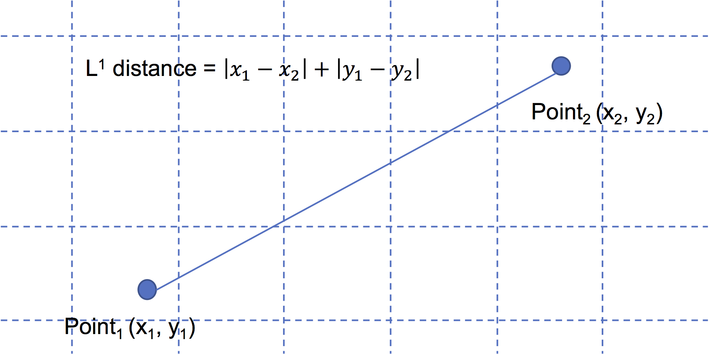
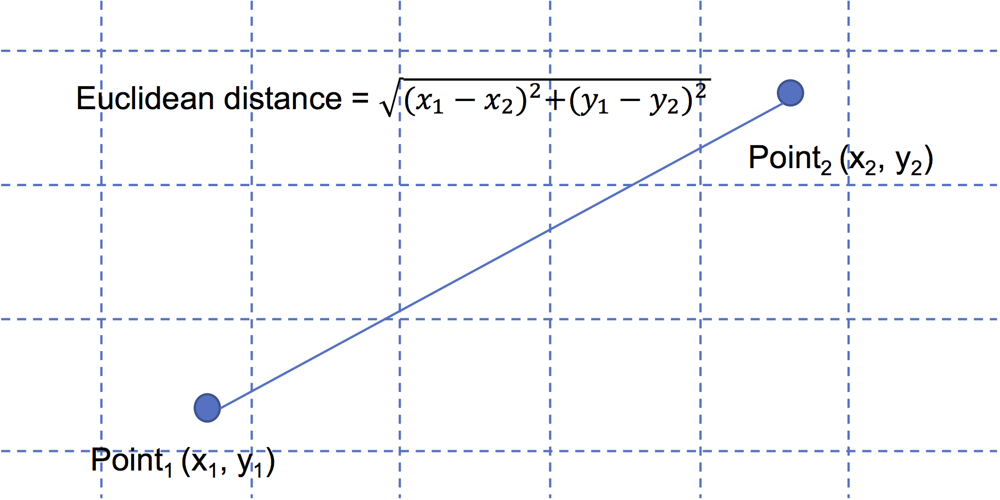
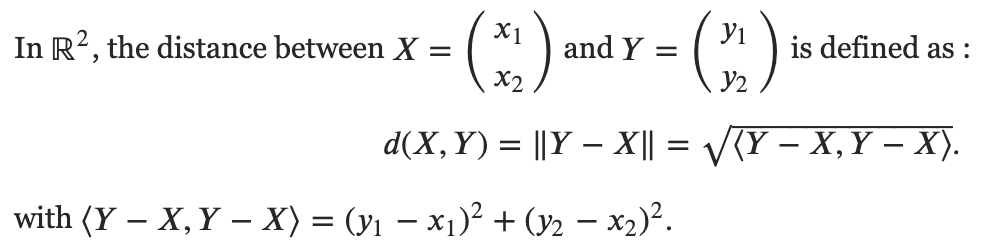
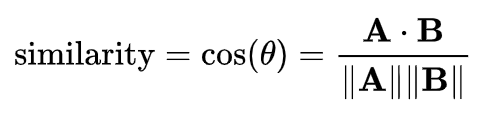
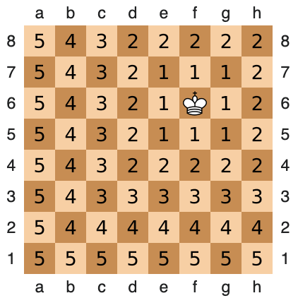
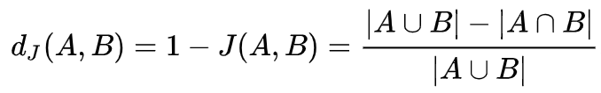
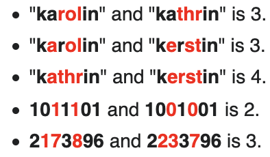

# Distance_metric
A collection of distance metrics

## 1. <a href="https://en.wikipedia.org/wiki/Least_absolute_deviations">L1 norm</a>

The sum of the absolute differences between corresponding values.
Also known as least absolute deviations (LAD), least absolute errors (LAE)

## 2. L2 norm / <a href="https://en.wikipedia.org/wiki/Euclidean_distance">Euclidean distance</a>

The square root of the sum of the squares of the differences between corresponding values.

Using some linear algebra notation, we can express <a href="https://math.stackexchange.com/questions/1236465/euclidean-distance-and-dot-product">Euclidean distance using inner product notation</a>:

                                                                   
Notes:

(1). <a href="https://stats.stackexchange.com/questions/99171/why-is-euclidean-distance-not-a-good-metric-in-high-dimensions">the Euclidean distance is usually not a good metric in higher dimensional space.</a>

(2). When the square root is removed, it is an <a href="http://www.improvedoutcomes.com/docs/WebSiteDocs/Clustering/Clustering_Parameters/Euclidean_and_Euclidean_Squared_Distance_Metrics.htm">Euclidean Squared distance</a>

## 3. <a href="https://en.wikipedia.org/wiki/Mahalanobis_distance">Mahalanobis (Ma-ha-la-nobis) distance</a>

It is a multi-dimensional generalization of the idea of measuring how many standard deviations away P (points) is from the mean of D (distribution). This distance is zero if P is at the mean of D.

The Mahalanobis distance is thus unitless and scale-invariant, and takes into account the correlations of the data set.

A nice explanation can be found <a href="https://stats.stackexchange.com/questions/62092/bottom-to-top-explanation-of-the-mahalanobis-distance">here</a>. 

When the distribution (in terms of the covariance matrix) is an identity matrix, the distance is the same as the **Euclidean distance**.

## 4. <a href="https://en.wiktionary.org/wiki/Manhattan_distance">Manhattan distance</a>

Imagine a grid-like street geography of the Manhattan borough in NYC.

## 5. <a href="https://en.wikipedia.org/wiki/Cosine_similarity">Cosine distance</a>

cosine distance = 1 - cosine similarity

 (based on the <a href="https://en.wikipedia.org/wiki/Dot_product">dot product</a> of two vectors)

<a href="https://cmry.github.io/notes/euclidean-v-cosine">Cosine similarity</a>, which is good at measuring the similarity of patterns of feature changes, *independent of* the absolute amplitude of the compared feature vectors.
  
May be used in a number of ML algorithms, including kNN.

## 6. <a href="https://en.wikipedia.org/wiki/Minkowski_distance">Minkowski distance</a>

A generalization of both the Euclidean distance and the Manhattan distance in a normed vector space, used in kNN algorithm.

## 7. <a href="https://en.wikipedia.org/wiki/Pearson_correlation_coefficient#Pearson's_distance">Pearson's distance</a>

d(x,y) = 1 - Pearson's correlation (x, y)

## 8. <a href="https://en.wikipedia.org/wiki/Chebyshev_distance">Chebyshev (chessboard) distance</a>

The Chebyshev distance between two vectors or points x and y, with standard coordinates xi and yi, respectively, is

DChebyshev(x,y) := max( | xi - yi | )

That is, the distance between two vectors is the greatest of their differences along <b>any coordinate dimension</b>.

 (<a href="https://en.wikipedia.org/wiki/Chebyshev_distance">image source</a>)

 

May be used in the kNN algorithm.

## 9. <a href="https://en.wikipedia.org/wiki/Jaccard_index">Jaccard distance</a>

Dissimilarity between sample sets

Used to provide n x n matrix for <a href="https://en.wikipedia.org/wiki/Multidimensional_scaling">multidimensional scaling</a>.

## 10. <a href="https://en.wikipedia.org/wiki/Hamming_distance">Hamming distance</a>

Between two strings of equal length, the number of positions at which the corresponding symbols are different.

Examples (from <a href="https://en.wikipedia.org/wiki/Hamming_distance">wikipedia</a>): 

Some questions:

(1) when to use the Euclidean Squared distance metric?

(2) why it is a bad idea to use Euclidean distance in higher dimensional space?

(3) <a href="https://www.researchgate.net/post/What_is_the_best_distance_measure_for_high_dimensional_data">what distance metric should be used in higher dimensional space?</a>

(4) when to use the cosine distance metric?

