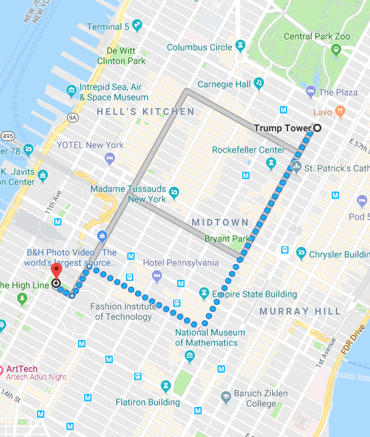

# distance_metric
A collection of distance metrics

1. <a href="https://en.wikipedia.org/wiki/Euclidean_distance">Euclidean_distance</a> (= Euclidean norm = L2 norm)

The square root of the sum of the squares of the differences between corresponding values.

Notes:

(1). <a href="https://stats.stackexchange.com/questions/99171/why-is-euclidean-distance-not-a-good-metric-in-high-dimensions">the Euclidean distance is usually not a good metric in higher dimensional space.</a>

(2). When the square root is removed, it is an <a href="http://www.improvedoutcomes.com/docs/WebSiteDocs/Clustering/Clustering_Parameters/Euclidean_and_Euclidean_Squared_Distance_Metrics.htm">Euclidean Squared distance</a>

2. <a href="https://en.wikipedia.org/wiki/Least_absolute_deviations">L1 norm/distance</a>

The sum of the absolute differences between corresponding values.
Also known as least absolute deviations (LAD), least absolute errors (LAE)

3. <a href="https://en.wikipedia.org/wiki/Mahalanobis_distance">Mahalanobis distance</a>

A very nice explanation can be found <a href="https://stats.stackexchange.com/questions/62092/bottom-to-top-explanation-of-the-mahalanobis-distance">here</a> 

Ma-ha-la-nobis distance is a measure of distnace between points in a given distribution.

It is unitless and scale-invariant.

When the distribution (in terms of the covariance matrix) is an identity matrix, the distance is the same as the **Euclidean distance**.

4. <a href="https://en.wiktionary.org/wiki/Manhattan_distance">Manhattan distance</a>

Imagine a grid-like street geography of the Manhattan borough in NYC.

5. Cosine distance

<a href="https://cmry.github.io/notes/euclidean-v-cosine">Cosine similarity</a>

To be completed:

(1) when to use the Euclidean Squared distance metric?

(2) why it is a bad idea to use Euclidean distance in higher dimensional space?

(3) <a href="https://www.researchgate.net/post/What_is_the_best_distance_measure_for_high_dimensional_data">what distance metric should be used in higher dimensional space?</a>

(4) when to use the cosine distance metric?

